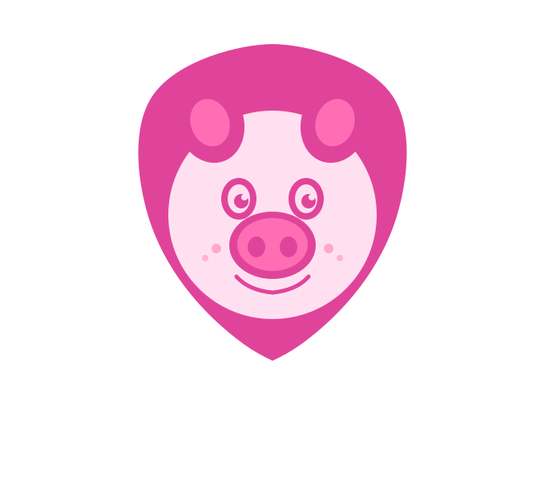

<p align="center">
  
</p>

<h1 align="center">nothing-browser</h1>
<p align="center"><em>Does nothing... except everything that matters.</em></p>

<p align="center">
  <a href="https://www.npmjs.com/package/nothing-browser"></a>
  <a href="LICENSE"></a>
  <a href="https://github.com/BunElysiaReact/nothing-browser/releases"></a>
</p>

---

A scraper-first headless browser library powered by the Nothing Browser Qt6/Chromium engine. Control real browser tabs, intercept network traffic, spoof fingerprints, capture WebSockets — all from Bun + TypeScript.

---

## Requirements

- [Bun](https://bun.sh) ≥ 1.0
- A Nothing Browser binary placed in your **project root** (see below)

---

## Binaries

There are three binaries. All are downloaded from the same place — [GitHub Releases](https://github.com/BunElysiaReact/nothing-browser/releases).

| Binary | What it is | Where it goes |
|--------|-----------|---------------|
| `nothing-browser` | Full UI browser app — DevTools, YouTube tab, Plugins, etc. | Install system-wide |
| `nothing-browser-headless` | No window, no GPU. Runs as a background daemon for the scraping lib. | **Your project root** |
| `nothing-browser-headful` | Visible browser window, script-controlled. Useful when a site needs a real display. | **Your project root** |

The `nothingbrowser` npm/Bun lib talks to whichever binary is in your project root over a local socket. You pick headless or headful depending on your use case.

---

## Install

```bash
bun add nothing-browser
```

Then download the binary for your platform from [GitHub Releases](https://github.com/BunElysiaReact/nothing-browser/releases) and place it in your project root.

### Linux

**Headless** (no visible window — most common for scraping)
```bash
tar -xzf nothing-browser-headless-*-linux-x86_64.tar.gz
chmod +x nothing-browser-headless
```

**Headful** (visible window, script-controlled)
```bash
tar -xzf nothing-browser-headful-*-linux-x86_64.tar.gz
chmod +x nothing-browser-headful
```

**Full browser** (system-wide install, for using the UI)
```bash
sudo dpkg -i nothing-browser_*_amd64.deb
# or
tar -xzf nothing-browser-*-linux-x86_64.tar.gz
cd nothing-browser-*-linux-x86_64
./nothing-browser
```

### Windows

Download the `.zip` for your chosen binary → extract → place `nothing-browser-headless.exe` or `nothing-browser-headful.exe` in your project root. The JRE is bundled in the full browser zip.

### macOS

Download the `.tar.gz` for your chosen binary → extract → place the binary in your project root.

---

## Quick Start

```ts
import piggy from "nothing-browser";

await piggy.launch({ mode: "tab" });
await piggy.register("books", "https://books.toscrape.com");

await piggy.books.navigate();
await piggy.books.waitForSelector(".product_pod");

const books = await piggy.books.evaluate(() =>
  Array.from(document.querySelectorAll(".product_pod")).map(el => ({
    title: el.querySelector("h3 a")?.getAttribute("title") ?? "",
    price: el.querySelector(".price_color")?.textContent?.trim() ?? "",
  }))
);

console.log(books);
await piggy.close();
```

---

## Modes

### Tab mode (default)
All sites share one browser process, each in its own tab.

```ts
await piggy.launch({ mode: "tab" });
```

### Process mode
Each site gets its own browser process on a dedicated socket. More isolation, more RAM.

```ts
await piggy.launch({ mode: "process" });
```

---

## Headless vs Headful

**Headless** — no display needed, runs anywhere including CI. Use this by default.

```
nothing-browser-headless        ← in your project root
```

**Headful** — opens a real visible Chromium window that your script drives. Use this when a site detects headless mode or requires a real display (canvas fingerprinting, certain login flows, etc).

```
nothing-browser-headful         ← in your project root
```

Both binaries expose the exact same socket API. Switching is just swapping which binary is in your project root.

---

## Examples

### Scrape a site and expose it as an API

```ts
import piggy from "nothing-browser";

await piggy.launch({ mode: "tab" });
await piggy.register("books", "https://books.toscrape.com");

await piggy.books.intercept.block("*google-analytics*");
await piggy.books.intercept.block("*doubleclick*");
await piggy.books.intercept.block("*facebook*");

piggy.books.api("/list", async (_params, query) => {
  const page = query.page ? parseInt(query.page) : 1;
  const url = page === 1
    ? "https://books.toscrape.com"
    : `https://books.toscrape.com/catalogue/page-${page}.html`;

  await piggy.books.navigate(url);
  await piggy.books.waitForSelector(".product_pod", 10000);

  const books = await piggy.books.evaluate(() => {
    const ratingMap: Record<string, number> = {
      One: 1, Two: 2, Three: 3, Four: 4, Five: 5,
    };
    return Array.from(document.querySelectorAll(".product_pod")).map(el => ({
      title:     el.querySelector("h3 a")?.getAttribute("title") ?? "",
      price:     el.querySelector(".price_color")?.textContent?.trim() ?? "",
      rating:    ratingMap[el.querySelector(".star-rating")?.className.replace("star-rating","").trim() ?? ""] ?? 0,
      available: el.querySelector(".availability")?.textContent?.trim() ?? "",
    }));
  });

  return { page, count: books.length, books };
}, { ttl: 300_000 });

piggy.books.noclose();
await piggy.serve(3000);
```

---

### Middleware — auth + logging

```ts
const logMiddleware = async ({ query, params }: any) => {
  console.log("[middleware] incoming request", { params, query });
};

const authMiddleware = async ({ headers, set }: any) => {
  const key = headers["x-api-key"];
  if (!key || key !== "piggy-secret") {
    set.status = 401;
    throw new Error("Unauthorized: missing or invalid x-api-key");
  }
};

piggy.books.api("/search", async (_params, query) => {
  if (!query.q) return { error: "query param 'q' required" };

  await piggy.books.navigate("https://books.toscrape.com");
  await piggy.books.waitForSelector(".product_pod", 10000);

  const books = await piggy.books.evaluate((q: string) =>
    Array.from(document.querySelectorAll(".product_pod"))
      .filter(el =>
        el.querySelector("h3 a")?.getAttribute("title")?.toLowerCase().includes(q.toLowerCase())
      )
      .map(el => ({
        title: el.querySelector("h3 a")?.getAttribute("title") ?? "",
        price: el.querySelector(".price_color")?.textContent?.trim() ?? "",
      }))
  , query.q);

  return { query: query.q, count: books.length, books };
}, { ttl: 120_000, before: [logMiddleware, authMiddleware] });
```

---

### Network capture

```ts
await piggy.books.capture.clear();
await piggy.books.capture.start();
await piggy.books.wait(300);

await piggy.books.navigate("https://books.toscrape.com");
await piggy.books.waitForSelector("body", 10000);
await piggy.books.wait(2000);

await piggy.books.capture.stop();

const requests = await piggy.books.capture.requests();
const ws       = await piggy.books.capture.ws();
const storage  = await piggy.books.capture.storage();
const cookies  = await piggy.books.capture.cookies();

console.log(`${requests.length} requests, ${ws.length} WS frames`);
```

---

### Session persistence

```ts
import { existsSync, readFileSync, writeFileSync } from "fs";

const SESSION_FILE = "./session.json";

if (existsSync(SESSION_FILE)) {
  const saved = JSON.parse(readFileSync(SESSION_FILE, "utf8"));
  await piggy.books.session.import(saved);
}

process.on("SIGINT", async () => {
  const session = await piggy.books.session.export();
  writeFileSync(SESSION_FILE, JSON.stringify(session, null, 2));
  await piggy.close({ force: true });
  process.exit(0);
});
```

---

### Human mode

```ts
piggy.actHuman(true);

await piggy.books.click(".product_pod h3 a");
await piggy.books.type("#search", "mystery novels");
await piggy.books.scroll.by(400);
```

---

### Screenshot / PDF

```ts
await piggy.books.screenshot("./out/page.png");
await piggy.books.pdf("./out/page.pdf");

const b64 = await piggy.books.screenshot();
```

---

### Multi-site parallel scraping

```ts
await piggy.register("site1", "https://example.com");
await piggy.register("site2", "https://example.org");

const titles = await piggy.all([piggy.site1, piggy.site2]).title();
const h1s    = await piggy.diff([piggy.site1, piggy.site2]).fetchText("h1");
// → { site1: "...", site2: "..." }
```

---

## API Reference

### `piggy.launch(opts?)`

| Option | Type | Default |
|--------|------|---------|
| `mode` | `"tab" \| "process"` | `"tab"` |

### `piggy.register(name, url)`
Registers a site. Accessible as `piggy.<name>` after registration.

### `piggy.actHuman(enable)`
Toggles human-like interaction timing globally.

### `piggy.serve(port, opts?)`
Starts the Elysia HTTP server. Built-in routes: `GET /health`, `GET /cache/keys`, `DELETE /cache`.

### `piggy.routes()`
Returns all registered API routes with method, path, TTL, and middleware count.

### `piggy.close(opts?)`

```ts
await piggy.close();                // graceful — respects noclose()
await piggy.close({ force: true }); // kills everything immediately
```

### Site methods

#### Navigation
```ts
site.navigate(url?)
site.reload() / site.goBack() / site.goForward()
site.waitForNavigation()
site.waitForSelector(selector, timeout?)
site.waitForResponse(urlPattern, timeout?)
site.title() / site.url() / site.content()
site.wait(ms)
```

#### Interactions
```ts
site.click(selector, opts?)
site.doubleClick(selector) / site.hover(selector)
site.type(selector, text, opts?)     // opts: { delay?, wpm?, fact? }
site.select(selector, value)
site.keyboard.press(key)
site.keyboard.combo(combo)           // e.g. "Ctrl+A"
site.mouse.move(x, y)
site.mouse.drag(from, to)
site.scroll.to(selector) / site.scroll.by(px)
```

#### Data
```ts
site.fetchText(selector)             // → string | null
site.fetchLinks(selector)            // → string[]
site.fetchImages(selector)           // → string[]
site.search.css(query) / site.search.id(query)
site.evaluate(js | fn, ...args)
```

#### Network
```ts
site.capture.start() / .stop() / .clear()
site.capture.requests() / .ws() / .cookies() / .storage()
site.intercept.block(pattern)
site.intercept.redirect(pattern, redirectUrl)
site.intercept.headers(pattern, headers)
site.intercept.clear()
site.blockImages() / site.unblockImages()
```

#### Cookies & Session
```ts
site.cookies.set(name, value, domain, path?)
site.cookies.get(name) / .delete(name) / .list()
site.session.export() / site.session.import(data)
```

#### API
```ts
site.api(path, handler, opts?)
// opts: { ttl?, method?, before?: middleware[] }
// handler: (params, query, body) => Promise<any>

site.noclose()
site.screenshot(filePath?) / site.pdf(filePath?)
```

---

## Binary download

| Platform | Headless | Headful | Full Browser |
|----------|----------|---------|--------------|
| Linux x86_64 (deb) | `nothing-browser-headless_*_amd64.deb` | `nothing-browser-headful_*_amd64.deb` | `nothing-browser_*_amd64.deb` |
| Linux x86_64 (tar.gz) | `nothing-browser-headless-*-linux-x86_64.tar.gz` | `nothing-browser-headful-*-linux-x86_64.tar.gz` | `nothing-browser-*-linux-x86_64.tar.gz` |
| Windows x64 | `nothing-browser-headless-*-windows-x64.zip` | `nothing-browser-headful-*-windows-x64.zip` | `nothing-browser-*-windows-x64.zip` |
| macOS | `nothing-browser-headless-*-macos.tar.gz` | `nothing-browser-headful-*-macos.tar.gz` | `nothing-browser-*-macos.dmg` |

→ [All releases](https://github.com/BunElysiaReact/nothing-browser/releases)

---

## License

MIT © [Ernest Tech House](https://github.com/BunElysiaReact/nothing-browser)