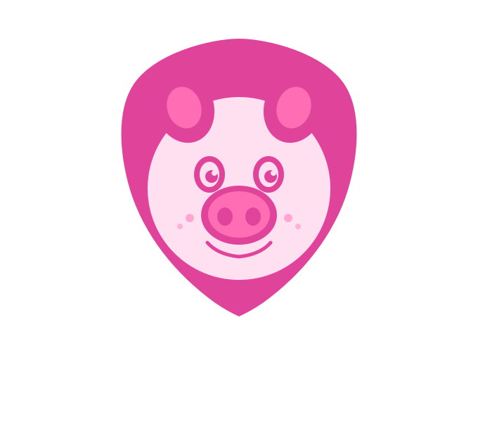

# `nothing-browser`

<p align="center">
  
</p>

<h1 align="center">nothing-browser</h1>
<p align="center"><em>Does nothing... except everything that matters.</em></p>

<p align="center">
  <a href="https://www.npmjs.com/package/nothing-browser"></a>
  <a href="LICENSE"></a>
  <a href="https://github.com/BunElysiaReact/nothing-browser/releases"></a>
</p>

**A scraper-first headless browser library** powered by the Nothing Browser Qt6/Chromium engine. Control real browser tabs, intercept network traffic, spoof fingerprints, capture WebSockets — all from Bun + TypeScript.

```ts
import piggy from "nothing-browser";

await piggy.launch();
await piggy.register("books", "https://books.toscrape.com");
await piggy.books.navigate();

const books = await piggy.books.evaluate(() =>
  Array.from(document.querySelectorAll(".product_pod")).map(el => ({
    title: el.querySelector("h3 a")?.getAttribute("title") ?? "",
    price: el.querySelector(".price_color")?.textContent?.trim() ?? "",
  }))
);

console.log(books);
await piggy.close();
```

> **📚 Full documentation is available here:**  
> [https://nothing-browser-docs.pages.dev/guide/piggy/quickstart](https://nothing-browser-docs.pages.dev/guide/piggy/quickstart)

---

## 🎉 v2.0.0 — the binary is now a shared daemon

The single biggest change in `nothing-browser` since it launched. The
JS library used to talk to the binary over a 1:1 named pipe — one
script, one binary, one browser, every time. **That's gone.** The
binary now runs a single WebSocket server on a fixed port
(**2005 — always, never configurable**), and any number of scripts can
connect to it at once.

**What that means in practice:**

- **`piggy.launch()` joins before it spawns.** If a Nothing Browser
  instance is already running, your script connects to it instead of
  starting a second one. Ten scraper scripts running at once can now
  share one binary and one browser process instead of ten.
- **Language-agnostic by design.** The wire protocol is plain JSON over
  WebSocket text frames — nothing JS-specific about it. Want to drive
  the binary from Python, C++, Go, whatever? See
  [`PROTOCOL.md`](PROTOCOL.md) for the full spec and working example
  clients. This JS library is just one client among however many you
  want to write.
- **Optional key auth**, enforced on every connection to an instance —
  including local ones — not just remote. Useful the moment you're
  exposing a daemon beyond your own machine.
- **⚠️ Breaking change: `piggy.close()` is now per-script, not global.**
  In v1, calling `close()` tore down the entire binary. With a shared
  daemon, that would mean one script finishing its job kills the browser
  out from under every other script using it — so `close()` now only
  closes *your* tabs and disconnects *your* script. The daemon keeps
  running for everyone else. If you actually want to end the shared
  instance for everyone, there's a new method for that:
  **`piggy.shutdown()`.** If you're upgrading from v1 and relied on
  `close()` ending the process, switch that call to `shutdown()`.

```ts
// v1 behavior — close() ended everything
await piggy.close(); // used to kill the whole binary

// v2 — close() is scoped to you; shutdown() is the real kill switch
await piggy.close();    // just your tabs, daemon stays up for others
await piggy.shutdown(); // ends the shared daemon for every connected script
```

Nothing about the day-to-day scraping API changed — `site.*` methods
all work exactly the same. This is purely a transport-and-lifecycle
upgrade under the hood.

---

## Why nothing-browser?

|                         | nothing-browser | Puppeteer | Playwright |
|------------------------|----------------|-----------|------------|
| Imports                | **1**          | 5–10      | 5–10       |
| Lines to scrape a site | **~20**        | 80–200    | 80–200     |
| Fingerprint spoofing   | ✅ built in    | ❌ plugin  | ❌ plugin  |
| Network capture        | ✅ built in    | ❌ manual  | ❌ manual  |
| Built-in API server    | ✅             | ❌        | ❌         |
| Cloudflare bypass      | ✅ passes      | ⚠️ often blocked | ⚠️ often blocked |
| Shared multi-script daemon | ✅ one binary, many scripts | ❌ one browser per script | ❌ one browser per script |
| **Browser → Node.js RPC** | ✅ **`exposeFunction`** | ✅ `page.exposeFunction` | ✅ `page.exposeFunction` |

One import. No 47 plugins to avoid detection. Just write your scraper and go.

For very basic, static, low-effort scraping jobs — a handful of pages,
nothing anti-bot, no session persistence — Puppeteer is a reasonably
common lighter-weight pick too, since there's no separate binary process
to manage. `nothing-browser` handles that same simple case fine, and
scales up into everything above if the project ever needs it.

---

## Requirements

- **[Bun](https://bun.sh) ≥ 1.0**
- A **Nothing Browser binary** placed in your **project root** (see [Binaries](#binaries))

---

## Binaries

Download the correct binary from **[GitHub Releases](https://github.com/BunElysiaReact/nothing-browser/releases)**.

| Binary | What it is | Where it goes |
|--------|-----------|---------------|
| `nothing-browser` | Full UI browser app (DevTools, YouTube, Plugins) | Install system-wide |
| `nothing-browser-headless` | No window, no GPU – for automated scraping | **Your project root** |
| `nothing-browser-headful` | Visible window, script-controlled – for debugging | **Your project root** |

The library talks to the binary over a WebSocket on a fixed port
(**2005**, always — nothing to configure). If a Nothing Browser instance is
already running when you call `piggy.launch()`, the library just connects
to it instead of spawning a second one — any number of scripts can share
one binary and one browser. Prefer writing your scraper in another
language entirely? The binary doesn't care who's on the other end of the
socket — see [`PROTOCOL.md`](PROTOCOL.md) for the full wire protocol if
you want to skip this JS library and talk to it directly.

---

## Install

```bash
bun add nothing-browser
```

Then download the binary and place it in your project root.

<details>
<summary><strong>Linux</strong></summary>

```bash
# Headless (most common for scraping)
tar -xzf nothing-browser-headless-*-linux-x86_64.tar.gz
chmod +x nothing-browser-headless

# Headful (visible window)
tar -xzf nothing-browser-headful-*-linux-x86_64.tar.gz
chmod +x nothing-browser-headful

# Full browser (system-wide)
sudo dpkg -i nothing-browser_*_amd64.deb
```
</details>

<details>
<summary><strong>Windows</strong></summary>

Download the `.zip` → extract → place `.exe` in your project root.
</details>

<details>
<summary><strong>macOS</strong></summary>

Download the `.tar.gz` → extract → place binary in your project root.
</details>

---

## Headless vs Headful

```ts
// Headless – no display, runs anywhere (default)
await piggy.launch({ mode: "tab", binary: "headless" });

// Headful – visible window for debugging
await piggy.launch({ mode: "tab", binary: "headful" });
```

Switching is just changing one word.

---

## Key Features (with Examples)

### 🔥 Browser → Node.js RPC (`exposeFunction`)

Call Node.js functions directly from browser JavaScript.

```ts
await piggy.whatsapp.exposeFunction("onNewMessage", async (message) => {
  await db.messages.insert(message);
  return { saved: true, id: crypto.randomUUID() };
});
```

### 📡 Request Interception

Block, redirect, or serve custom responses.

```ts
await piggy.app.intercept.respond("*/api/users*", async () => ({
  status: 200,
  body: JSON.stringify([{ id: 1, name: "Cached User" }])
}));
```

### 🧠 Human Mode

Add random delays, typos, and natural scrolling.

```ts
piggy.actHuman(true);
await piggy.books.click(".product_pod h3 a");
```

### 💾 Session Persistence

Save and restore cookies, storage, and state.

```ts
await piggy.site.session.export(); // save
await piggy.site.session.import(data); // restore
```

### 🚀 Built‑in API Server

Turn your scraper into a REST API.

```ts
piggy.books.api("/list", async () => ({ books }));
await piggy.serve(3000);
// GET http://localhost:3000/books/list
```

> **For many more examples** (WebSocket capture, multi‑site scraping, PDF/screenshot, middleware, etc.), see the **[full documentation](https://nothing-browser-docs.pages.dev/guide/piggy/quickstart)**.

---

## API Reference (Quick)

### Core

| Method | Description |
|--------|-------------|
| `piggy.launch(opts?)` | Start browser (`mode`, `binary`, `key`) — joins an already-running instance on port 2005 if one exists |
| `piggy.connect(opts)` | Connect to a specific instance, local or remote (`host`, `key`) — port is always 2005 |
| `piggy.register(name, url)` | Register a site → `piggy.<name>` |
| `piggy.actHuman(enable)` | Enable human‑like timing |
| `piggy.expose(name, handler)` | Global RPC function |
| `piggy.serve(port)` | Start API server |
| `piggy.close(opts?)` | Close gracefully or force — closes only *your* tabs/connection, other scripts sharing the instance are unaffected |
| `piggy.shutdown()` | Terminate the shared binary entirely — every script, every tab. Use deliberately. |

### Site Methods

| Category | Methods |
|----------|---------|
| **Navigation** | `navigate()`, `reload()`, `goBack()`, `goForward()`, `waitForSelector()` |
| **Interactions** | `click()`, `type()`, `hover()`, `select()`, `keyboard.press()`, `scroll.to()` |
| **Data** | `evaluate()`, `fetchText()`, `fetchLinks()`, `fetchImages()` |
| **RPC** | `exposeFunction()`, `unexposeFunction()`, `exposeAndInject()` |
| **Network** | `capture.start()`, `intercept.respond()`, `intercept.modifyResponse()`, `blockImages()` |
| **Session** | `cookies.set()`, `session.export()`, `session.import()` |
| **Output** | `screenshot()`, `pdf()` |

> **Full API reference:** [https://nothing-browser-docs.pages.dev/guide/piggy/api-reference](https://nothing-browser-docs.pages.dev/guide/piggy/api-reference)

---

## How `exposeFunction` Works

1. Browser injects a Promise‑returning stub into `window.fnName`.
2. Calls are queued to `__NOTHING_QUEUE__`.
3. C++ polls the queue (every 250ms) and sends the call via socket.
4. Your Node.js handler runs.
5. The result is sent back and the browser’s Promise resolves.

The function survives page navigations (injected at `DocumentCreation`) and works in both tab and process modes.

---

## Binary Download Links

| Platform | Headless | Headful | Full Browser |
|----------|----------|---------|--------------|
| Linux x86_64 (deb) | `nothing-browser-headless_*_amd64.deb` | `nothing-browser-headful_*_amd64.deb` | `nothing-browser_*_amd64.deb` |
| Linux x86_64 (tar.gz) | `nothing-browser-headless-*-linux-x86_64.tar.gz` | `nothing-browser-headful-*-linux-x86_64.tar.gz` | `nothing-browser-*-linux-x86_64.tar.gz` |
| Windows x64 | `nothing-browser-headless-*-windows-x64.zip` | `nothing-browser-headful-*-windows-x64.zip` | `nothing-browser-*-windows-x64.zip` |
| macOS | `nothing-browser-headless-*-macos.tar.gz` | `nothing-browser-headful-*-macos.tar.gz` | `nothing-browser-*-macos.dmg` |

➡️ **[All releases on GitHub](https://github.com/BunElysiaReact/nothing-browser/releases)**

---

## Contributing & Security

- **Contributing:** See the [Contributing Guide](https://nothing-browser-docs.pages.dev/guide/community/contributing)
- **Security issues:** Email `ernesttechhouse@gmail.com` (not a public issue)

---

## License

MIT © [Ernest Tech House](https://github.com/BunElysiaReact/nothing-browser)

---

*Part of the [Nothing Ecosystem](https://nothing-browser-docs.pages.dev). Built in Kenya 🇰🇪*